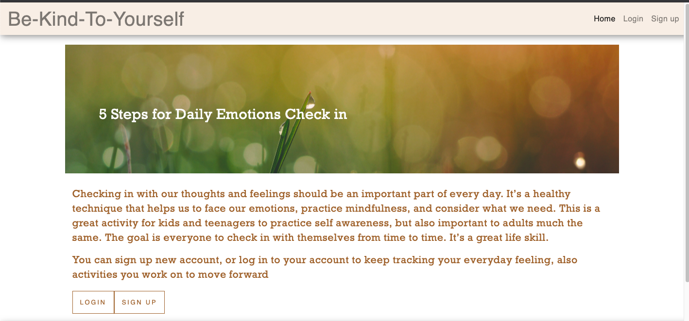
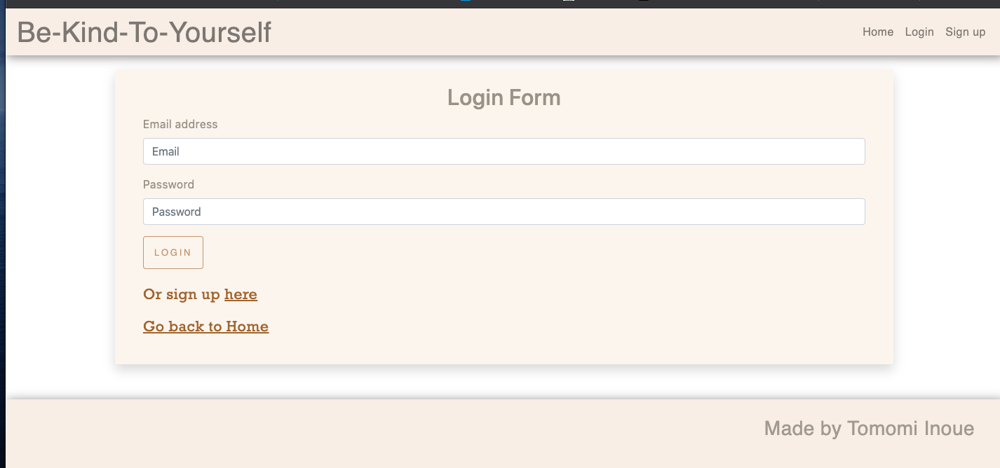
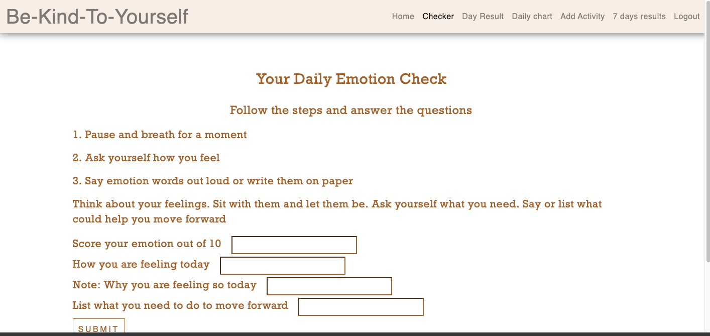
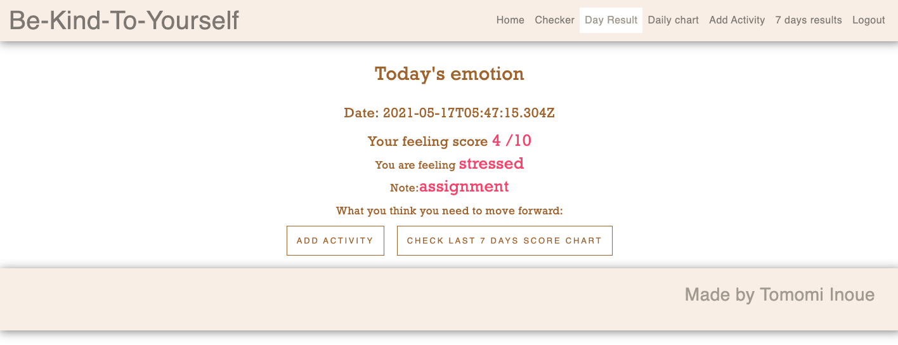
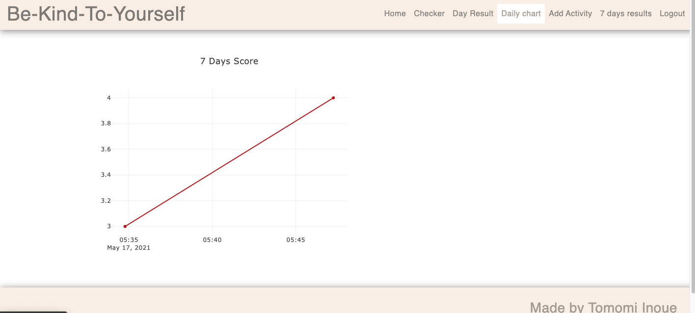
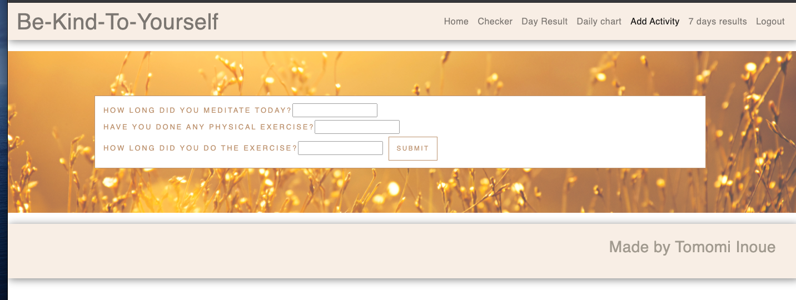

# Be-Kind-To-Yourself
BCS Project3 

<!-- TABLE OF CONTENTS -->
<details open="open">
  <summary>Table of Contents</summary>
  <ol>
    <li>
      <a href="#about-the-project">About The Project</a>
    </li>
    <li><a href="#Technology">Technology</a></li>
    <li><a href="#learning">Learning</a></li>
    <li><a href="#getting-started">Getting started</a></li>
    <li><a href="#license">License</a></li>
    <li><a href="#screenshots">Screen shots</a></li>
    <li><a href="#contact">Contact</a></li>
  </ol>
</details>


<!-- ABOUT THE PROJECT -->
## About The Project
Using full stack technology to create unique web application

## Technology

Major technology I used for this application

* [React](https://reactjs.org/)
* [Node.js](https://nodejs.org/en/)
* [Express](https://expressjs.com/)
* [MongoDb](https://www.mongodb.com/cloud/atlas1)
* [Mongoose](https://mongoosejs.com/)
* [React-Bootstrap](https://react-bootstrap.github.io/)
* [Passport](http://www.passportjs.org/)
* [bcrypt](https://www.npmjs.com/package/bcrypt)
* [moment.js](https://momentjs.com/)
* [plotly](https://plotly.com/javascript/)

## Learning

Using every single knowledge we have learned in past 24weeks to create 
own web application. It was very much challenging for me. Could not remember lot of things, also did not know lot of things. 
There are so much more details to improve, but I am glad working out to create this application and it was tough challenge but definitely made a progress as a full stack web developer.

## Getting Started

To use budget tracker locally, use http://localhost:3000 after completing the following steps:

```js
git clone github.com/Chib1co/Be-Kind-To-Yourself
npm install
cd client
npm install
npm start
```

<!-- LICENSE -->
## License
[](https://opensource.org/licenses/MIT)


## Screenshots

* Home page


* Logging in page


* Once you logged in, you can start emotion check


* Once you submit the check, redirected to latest result page


* You can check chart of your score from last 7 checks


* Adding activities you did to move forward

<!-- CONTACT -->
## Contact

Tomomi Inoue 
</br>

Project Link: [https://github.com/Chib1co/Be-Kind-To-Yourselfe](https://github.com/Chib1co/Be-Kind-To-Yourself)

Deployed page: [https://polar-tundra-51055.herokuapp.com/](https://polar-tundra-51055.herokuapp.com/)

Presentation Slide: [https://docs.google.com/presentation/d/1vS_knluv0PbEoeepXZATWnwdpI5_KGBMZUPOZusjD0M/edit?usp=sharing](https://docs.google.com/presentation/d/1vS_knluv0PbEoeepXZATWnwdpI5_KGBMZUPOZusjD0M/edit?usp=sharing)
